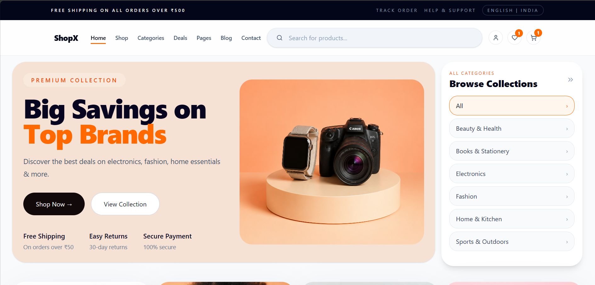
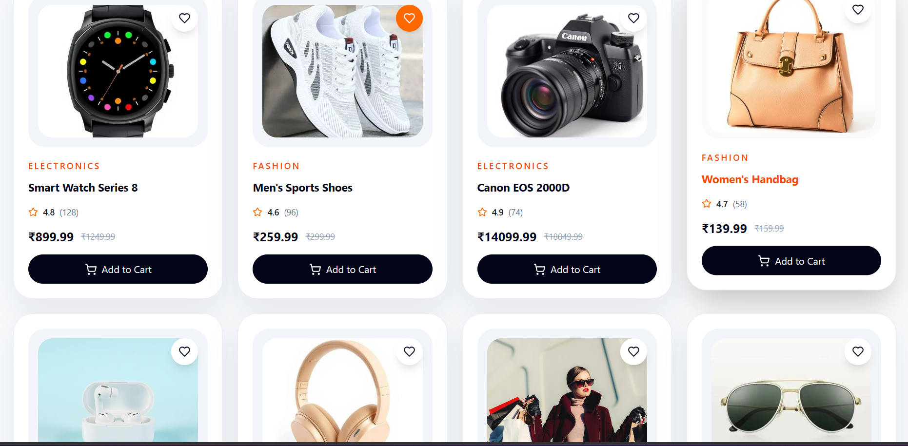
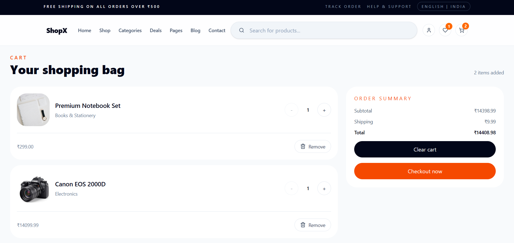
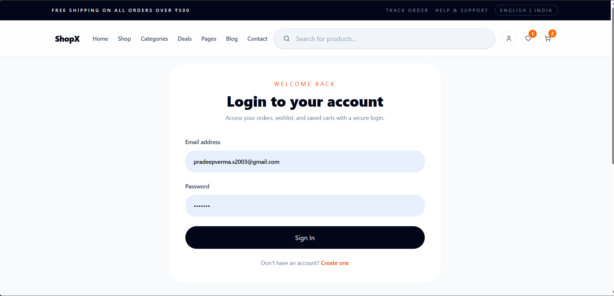

# 🛍️ ShopX – Full-Stack E-Commerce Platform

<div align="center">

### Modern • Responsive • Secure • Scalable

A production-ready e-commerce platform built using **React, Node.js, Express, MongoDB, JWT Authentication, and Cloudinary**.

### 🌐 Live Demo

Frontend: https://shop-x-ecommerce-chi.vercel.app

### 🔗 Backend API

https://shopx-ecommerce-1szf.onrender.com

</div>

---

## 📖 About The Project

ShopX is a full-stack e-commerce application developed to simulate a real-world online shopping platform. The project focuses on performance, scalability, responsive UI design, secure authentication, and API-driven architecture.

Users can browse products, search and filter categories, manage their cart and wishlist, while administrators can manage inventory and product data through backend APIs.

---

## 🚀 Live Deployment

| Service     | URL                                            |
| ----------- | ---------------------------------------------- |
| Frontend    | https://shop-x-ecommerce-chi.vercel.app        |
| Backend API | https://shopx-ecommerce-1szf.onrender.com      |
| Repository  | https://github.com/PRADEEVERMA/shopX-ecommerce |

---

## 📸 Screenshots

### 🏠 Home Page



### 🛒 Product Catalog



### 🛍️ Shopping Cart



### 👤 User Registration



---

## ✨ Key Features

### 👥 User Features

* Secure User Authentication (JWT)
* Product Browsing & Search
* Category-Based Filtering
* Add to Cart Functionality
* Wishlist Management
* Responsive Design for Mobile & Desktop
* Dynamic Product Fetching
* Fast Client-Side Navigation

### 🛠️ Admin Features

* Create Products
* Update Products
* Delete Products
* Inventory Management
* Cloudinary Image Upload Support

---

## 🏗️ Tech Stack

### Frontend

* React.js
* React Router DOM
* Axios
* Vite
* CSS

### Backend

* Node.js
* Express.js
* MongoDB Atlas
* Mongoose
* JWT Authentication
* Multer
* Cloudinary

### Deployment

* Vercel (Frontend Hosting)
* Render (Backend Hosting)
* MongoDB Atlas (Database)

---

## 📂 Project Structure

```text
ShopX
│
├── frontend
│   ├── src
│   │   ├── components
│   │   ├── pages
│   │   ├── context
│   │   ├── api
│   │   └── assets
│
├── backend
│   ├── controllers
│   ├── routes
│   ├── models
│   ├── middleware
│   ├── config
│   └── uploads
│
├── images
└── README.md
```

---

## ⚙️ Local Setup

### Clone Repository

```bash
git clone https://github.com/PRADEEVERMA/shopX-ecommerce.git
cd shopX-ecommerce
```

### Install Dependencies

Backend:

```bash
cd backend
npm install
```

Frontend:

```bash
cd frontend
npm install
```

---

## 🔑 Environment Variables

Create a `.env` file inside the backend directory.

```env
PORT=5000

MONGO_URI=YOUR_MONGODB_URI

JWT_SECRET=YOUR_SECRET_KEY

CLIENT_URL=http://localhost:5173

CLOUDINARY_CLOUD_NAME=YOUR_CLOUD_NAME
CLOUDINARY_API_KEY=YOUR_API_KEY
CLOUDINARY_API_SECRET=YOUR_API_SECRET
```

---

## ▶️ Run The Application

### Start Backend

```bash
cd backend
npm run dev
```

### Start Frontend

```bash
cd frontend
npm run dev
```

Application URLs:

```text
Frontend → http://localhost:5173
Backend  → http://localhost:5000
```

---

## 📊 Architecture Highlights

* RESTful API Architecture
* JWT-Based Authentication
* MongoDB Database Integration
* Cloudinary Media Storage
* Reusable React Components
* Responsive UI Design
* Production Deployment Pipeline
* Secure Environment Variable Management

---

## 🎯 Future Enhancements

* Razorpay / Stripe Payment Integration
* Order Tracking System
* Product Reviews & Ratings
* Email Notifications
* Real-Time Notifications
* Admin Analytics Dashboard
* Coupon & Discount System
* Product Recommendation Engine

---

## 👨‍💻 Developer

### Pradeep Verma

GitHub:
https://github.com/PRADEEVERMA

LinkedIn:
(Add Your LinkedIn Profile)

Repository:
https://github.com/PRADEEVERMA/shopX-ecommerce

---

## ⭐ Support

If you found this project useful, consider giving it a **Star ⭐** on GitHub.

Your support helps improve the project and motivates future development.

---

<div align="center">

### Thank You For Visiting ShopX ❤️

Built with React • Node.js • MongoDB

</div>
